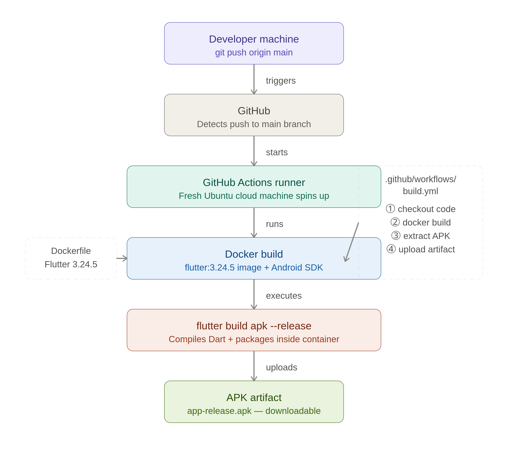

# 🛡️ HMPV Shield — Flutter App with Dockerized CI/CD Pipeline


A Flutter-based Android health awareness app with a fully containerized build environment and automated CI/CD pipeline using Docker and GitHub Actions.

> 🎯 **DevOps Highlight:** Every push to `main` automatically triggers a Docker-based build pipeline that compiles and packages the Android APK in a reproducible, containerized environment — no local Flutter/Android SDK installation required.

---

## ⚙️ DevOps Architecture



---

## 🐳 Docker — Containerized Build Environment

The `Dockerfile` bundles the entire Flutter + Android SDK toolchain into a single image, ensuring consistent, reproducible builds across any environment.

### Build locally

```bash
# Build the Docker image
docker build -t hmpv-shield-builder .

# Extract the APK from the container
docker create --name temp-container hmpv-shield-builder
docker cp temp-container:/app/build/app/outputs/flutter-apk/app-release.apk ./app-release.apk
docker rm temp-container
```

### Key decisions made
- Pinned Flutter to `3.24.5` (matching project's Dart SDK `^3.5.4`) to avoid breaking changes in newer Flutter versions
- Added `.dockerignore` to exclude `build/`, `.dart_tool/`, and IDE files — keeps image lean and build fast
- Debugged and resolved Gradle (8.4), AGP (8.3.2), Kotlin (2.1.0), and NDK version conflicts during containerization

---

## 🔁 CI/CD Pipeline — GitHub Actions

The `.github/workflows/build.yml` workflow automates the full build pipeline on every push.

### Pipeline steps
1. Checkout source code
2. Build Docker image with full Flutter + Android toolchain
3. Run `flutter build apk --release` inside the container
4. Extract APK from container
5. Upload APK as a downloadable artifact

### View live builds
→ [Actions Tab](https://github.com/Ramkumar200314/hmpv-shield-flutter-cicd/actions) — see all workflow runs, logs, and download built APKs

---

## 📥 Download the App (APK)

No need to build locally — the APK is automatically built by the CI/CD pipeline on every push.

1. Go to the [Actions tab](https://github.com/Ramkumar200314/hmpv-shield-flutter-cicd/actions)
2. Click the latest successful workflow run ✅
3. Scroll to the **Artifacts** section at the bottom
4. Click **app-release-apk** to download
5. Unzip and install the `.apk` on any Android device

> Enable **"Install from unknown sources"** on your Android phone before installing.

---

## 📱 About the App

**HMPV Shield** is a health awareness Android app. It spreads awareness about Human Metapneumovirus (HMPV) and provides tools for symptom checking, nearby hospital lookup, and real-time health news.

### Features
- 🩺 Symptom Checker — assess HMPV risk level
- 📰 Real-Time News — health news via NewsAPI
- 🗺️ Nearby Hospitals — Google Maps integration
- 🚨 Risk Assessment — categorized risk levels
- 📚 Virus Info, Precautions, Myths sections
- 🔥 Firebase backend integration

---

## 🛠️ Tech Stack

| Layer | Technology |
|-------|-----------|
| App | Flutter, Dart |
| Backend | Firebase (Firestore, Core) |
| Maps | Google Maps API |
| News | NewsAPI |
| Containerization | Docker |
| CI/CD | GitHub Actions |
| Build Tool | Gradle + Android SDK |

---

## 📷 App Screenshots

| Feature | Screenshot |
|--------|-------------|
| Splash Screen |  |
| Dashboard |  |
| Symptom Checker |  |
| News / Updates |  |
| Virus Info |  |
| Risk Assessment |  |
| Myths Debunked |  |
| Precautions |  |

---

## 🔧 Bugs Fixed During Containerization

This section documents real issues debugged and resolved during the Docker build process — demonstrating practical DevOps troubleshooting skills:

| Issue | Root Cause | Fix Applied |
|-------|-----------|-------------|
| Gradle version mismatch | Project used 8.4, Flutter needed 8.7+ | Pinned Gradle to compatible version |
| AGP version mismatch | AGP 8.3.2 incompatible with new Flutter | Kept AGP 8.3.2, pinned Flutter to 3.24.5 |
| Kotlin metadata error | Kotlin 2.1.0 metadata incompatible with AGP | Aligned Kotlin/AGP/Gradle versions |
| font_awesome_flutter IconData error | New Flutter made IconData a final class | Pinned Flutter to 3.24.5 (pre-breaking-change) |
| Missing screen reference | world_stat.dart deleted but import left in code | Removed broken import and remapped navigation |
| NDK version mismatch | Firebase plugins needed NDK 26.x, project had 25.x | Documented; build proceeds with warning |

---

## 📬 Contact

**Developer:** Ram Kumar Kundrapu
📧 Email: ramkumar20034@gmail.com
🔗 LinkedIn: [linkedin.com/in/ramkumarkundrapu](https://linkedin.com/in/ramkumarkundrapu)
📍 Location: Hyderabad, Telangana, India
